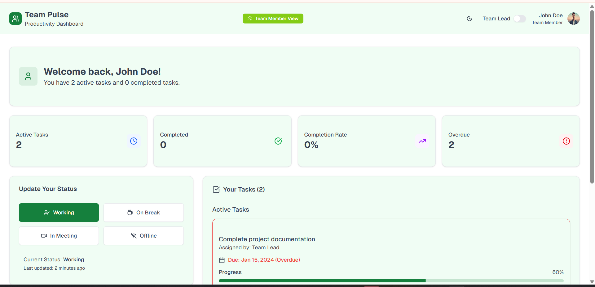

# 📊 Team Pulse Dashboard

A role-based productivity monitoring dashboard built with **React, Redux Toolkit, and TailwindCSS**.  
It enables **Team Leads** to monitor team members, assign tasks, and track productivity, while **Team Members** can update their status and manage progress on tasks.  

---

## 🚀 Project Overview
The **Team Pulse Dashboard** provides a clean and intuitive interface for internal team productivity monitoring.  

- **Team Lead View**:  
  - Monitor member statuses (Working · Break · Meeting · Offline).  
  - Assign tasks with due dates.  
  - Filter/sort members by status and active tasks.  

- **Team Member View**:  
  - Update status in real-time.  
  - View assigned tasks with due dates.  
  - Track progress with interactive progress bars.  

All state management is handled with **Redux Toolkit** for predictable and scalable application flow.  

---

## ⚡ Tech Stack
- **React 18**  
- **Redux Toolkit**  
- **TailwindCSS** (with optional Shadcn/UI components)  
- **Next.js 15 (App Router)** for project structure & routing  
- **TypeScript** for type safety  
- **pnpm** (preferred package manager, npm supported)  
- **PostCSS** for style processing  
- **Optional**: Recharts/Chart.js for visualizations  

---

## 🛠️ Setup Instructions

1️⃣ **Clone the repository**
```bash
git clone https://github.com/cse22148/Final_Assignment.git
cd Final_Assignment

2️⃣ Install dependencies

pnpm install
# or
npm install


3️⃣ Run the development server

pnpm dev


Now open http://localhost:3000
 in your browser.

4️⃣ Build for production

pnpm build
pnpm start

📸 Screenshots / Demo

### Screenshot 01


### Screenshot 02


### Screenshot 03


### Screenshot 04
)

## 👨‍💻 Author

Made with ❤️ by **Chanchal Teotia**

